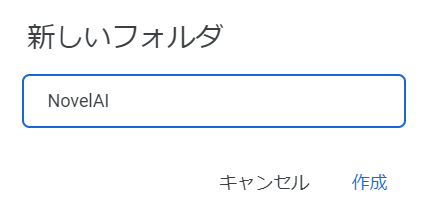
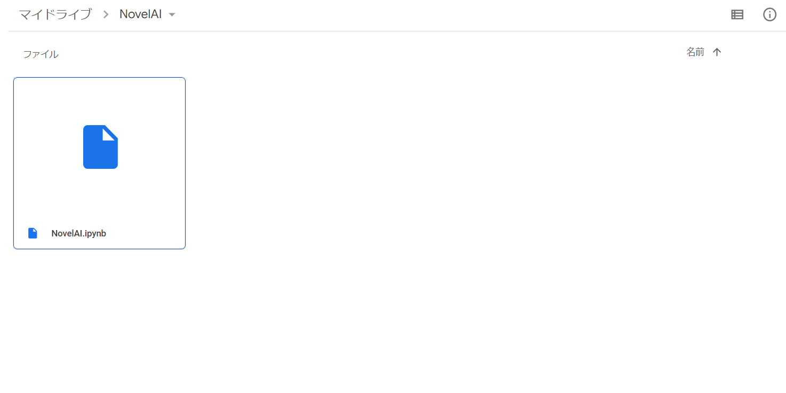
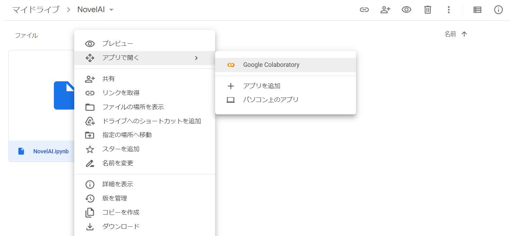
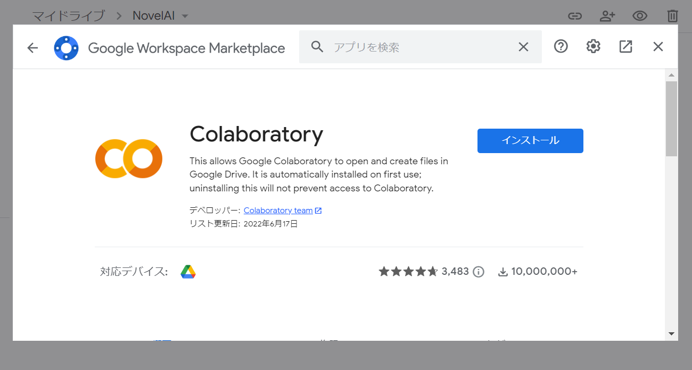
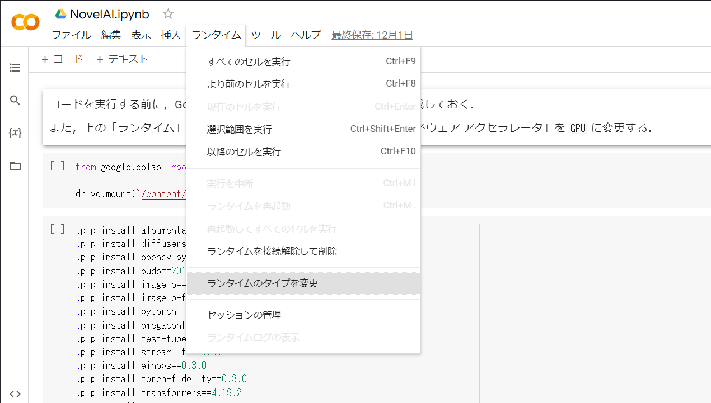
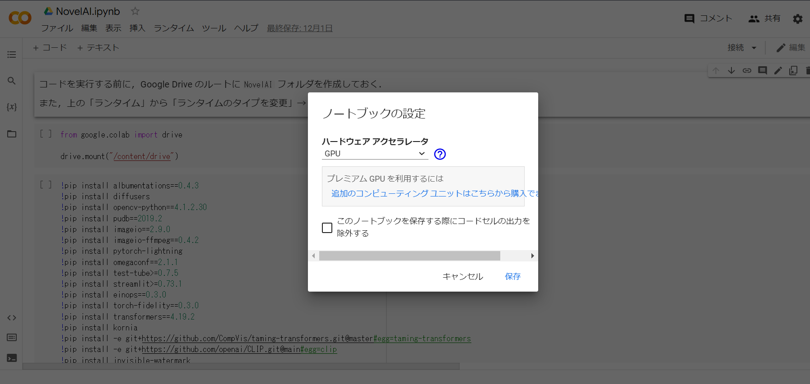

# novelai-colab
novelai-colab は NovelAI モデルを使用した `stable-diffusion-webui` を Google Colaboratory 上で動作させるための Notebook です．
また，この Notebook で使用しているモデルはリークされた NovelAI です．**自己責任**で実行してください．

# 動作条件
- Google Drive : 最低 60GB 以上
- Google Colaboratory : Free版では GPU の制限があるため，Colab Pro以上が望ましい

# 使用方法
1. Google Drive の最上階に `NovelAI` ディレクトリを作成する．

2. `NovelAI.ipynb` を `NovelAI` ディレクトリにアップロードする．

3. `NovelAI.ipynb`ファイルを右クリックし，「アプリで開く」から「Google Colaboratory」を選択する．

無ければ「アプリを追加」から「Google Colaboratory」を追加する．

4. 「ランタイム」から「ランタイムのタイプを変更」を選択し「ハードウェア アクセラレータ」を `GPU` に変更する．

5. コードを順番に実行していく．詳しくは Notebook 内のコメントを参照されたい．なお，NovelAI モデルのダウンロードに関するコードは初回のみ実行を行う．ダウンロードには非常に時間がかかるため余裕があるときに行おう．また，[90分ルールや12時間ルール](https://kenko-keep.com/12hour-90minit/)には注意が必要である．

6. Notebook の最後のコードを実行すると，`stable-diffusion-webui` のサーバが起動する．ログに出力されている `https://*.gradio.app/` にアクセスすることで NovelAI のモデルを使用した `stable-diffusion-webui` が利用できる．ログイン時のユーザ名・パスワードは初期設定では共に `user` である．

7. NovelAI を楽しみましょう！